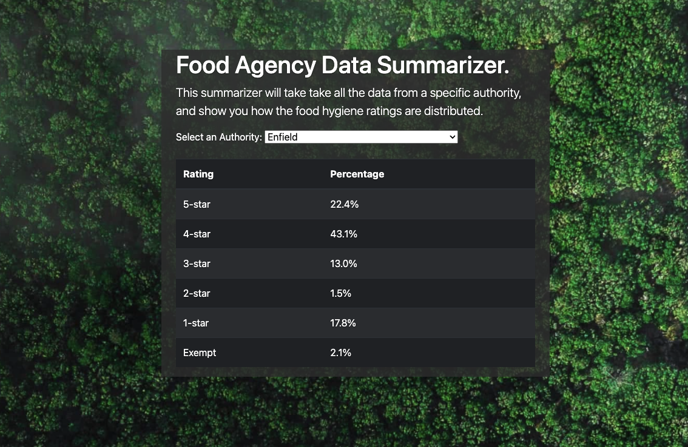

# Aviva Zero - Full Stack Tech Test: Node.js

## Prerequisites

- node.js >=14.8.0
- npm
- Access to the internet
- Suitable development environment

## Getting Started

- Install dependencies: `npm install`
- Run it: `npm start`
- Test it: `npm test`
- View it: http://localhost:8080 and http://localhost:8080/api

## Submission

- Please do not fork this repository.
- Please do not commit your code to GitHub.
